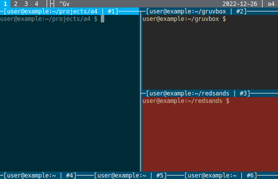

<div align="center">
<a href="https://a4term.com/">

</a>
</div>

## About The Project

[A4](https://a4term.com/) is a dynamic terminal window manager. One of eight
tiling layouts is dynamically applied to all visible terminals. The terminal
windows are grouped by tags making it easy to visually switch between contexts
of work. Color schemes are dynamically applied to each terminal window, based
on the text in its titlebar, helping the user to visually identify terminals
based on attributes such as hostname, userid, and any other text programmed to
display in the titlebar.

Four of the eight layouts divide the screen into two areas, one for a zoomed
window and the other for a stack of the remaining windows. These four layouts
can be adjusted during use to expand or shrink the number of windows in the
zoom area and the overall size of the zoom area. They are named for the
location of the zoom area: zoom\_left, zoom\_right, zoom\_top, and
zoom\_bottom. The other four layouts are fullscreen, grid, rows, and columns.

Each terminal window can be tagged with one or more tags. The user then selects
which tag or tags to view, and all windows with those tags are arranged in the
dynamic layout. The list of all tags is displayed on the left of the status
bar. Tag names are user defined with the default being the numerals 1 through
9.

Terminal windows can be minimized to a bar at the bottom of the screen. A
minimized terminal keeps its tags but stays out of the user's way until it is
unminimized again. Terminal windows can be set to read-only status in order to
prevent accidental typing or closing. Terminal windows can be added to a focus
group in order to type the same input into all simultaneously. Minimized and
read-only terminal windows are never typed into, even if they are included in
the focus group.

Terminal color schemes are dynamically applied by comparing the text of the
terminal's title with an ordered set of user-defined color rules.

A4 supports 24-bit truecolor and is configurable by editing an a4.ini file.
It is a partial rewrite of
[dvtm](https://www.brain-dump.org/projects/dvtm/),
which in turn is a text-based implementation of
[dwm](https://dwm.suckless.org/).



## Getting Started

### Packages

No distribution packages at this time.

### a4 Compile and Install

```sh
git clone https://github.com/rpmohn/a4
cd a4
make && sudo make install
```

### Prerequisites

#### libtickit

Requires [libtickit](https://www.leonerd.org.uk/code/libtickit/)
with minimum revision 809 code source. The latest released verision
0.4.3 is revision 803, so you will likely have to compile this yourself
for now. If you're compiling this yourself, make sure you also have
installed both
[libtermkey-dev](https://www.leonerd.org.uk/code/libtermkey/)
(probably in your package manager but maybe not with required minimum
v0.22) and
[libunibilium-dev](https://github.com/mauke/unibilium)
(probably in your package manager).

```sh
bzr branch https://bazaar.leonerd.org.uk/c/libtickit/
cd libtickit
make && sudo make install
```

#### libvterm

Requires [libvterm](https://www.leonerd.org.uk/code/libvterm/)
with minimum revision 819 code source. The latest released verision 0.3
is revision 813, so you will likely have to compile this yourself for
now.

```sh
bzr branch https://bazaar.leonerd.org.uk/c/libvterm/
cd libvterm
make && sudo make install
```

## Documentation

See [a4term.com](https://a4term.com/) for more documentation, including a copy
of the manual page and default keyboard maps.
