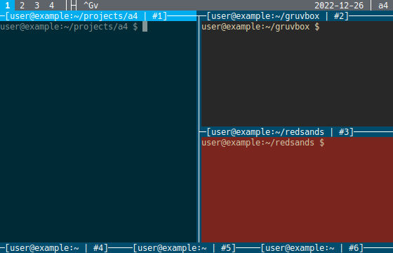

<div align="center">
<a href="https://a4term.com/">

</a>
</div>

## About The Project

[a4] is a dynamic terminal window manager. One of eight tiling layouts is
dynamically applied to all visible terminals. The terminal windows are grouped
by tags, making it easy to visually switch between contexts of work. a4
automatically runs in a persistent session from which you can detach and
reconnect. Any number of named sessions can exist simultaneously. Color schemes
are dynamically applied to each terminal window, based on the text in its
titlebar, helping the user to visually identify terminals based on attributes
such as hostname, userid, and any other text programmed to display in the
titlebar.

Four of the eight layouts divide the screen into two areas, one for a zoomed
window and the other for a stack of the remaining windows. These four layouts
can be adjusted during use to expand or shrink the number of windows in the
zoom area and the overall size of the zoom area. They are named for the
location of the zoom area: zoom\_left, zoom\_right, zoom\_top, and
zoom\_bottom. The other four layouts are fullscreen, grid, rows, and columns.

Each terminal window can be tagged with one or more tags. The user then selects
which tag or tags to view, and all windows with those tags are arranged in the
dynamic layout. The list of all tags is displayed on the left of the status
bar. Tag names are user defined with the default being the numerals 1 through
9.

Terminal windows can be minimized to a bar at the bottom of the screen. A
minimized terminal keeps its tags but stays out of the user's way until it is
unminimized again. Terminal windows can be set to read-only status in order to
prevent accidental typing or closing. Terminal windows can be added to a focus
group in order to type the same input into all simultaneously. Minimized and
read-only terminal windows are never typed into, even if they are included in
the focus group.

Terminal color schemes are dynamically applied by comparing the text of the
terminal's title with an ordered set of user-defined color rules.

a4 supports 24-bit truecolor and is configurable by editing an a4.ini file. It
is a partial rewrite of [dvtm], which in turn is a text-based implementation of
[dwm]. a4 now incorporates the concepts of the [abduco] project for persistence
and session management.



<!--
## Distribution Packages

#### [Void Linux]

Install using the xbps package manager

```sh
sudo xbps-install -S a4
```

#### [Nix]

Install using `nix-env`

``` sh
nix-env -iA nixos.a4term # change `nixos` for `nixpkgs`, if on a non-NixOS system
```

Try it with `nix-shell`

``` sh
nix-shell -p a4term
```
-->

## a4 Compile and Install

It is best to compile the code yourself, if possible. If you don't have that
capability on your system there are two installation scripts available in
[releases] that easily installs pre-compiled binaries for your machine
architecture (`uname -m`). One script, `install.sh`, installs a4 for all users
on your system and must be run with sudo or as root. The other,
`install-local.sh`, requires no elevated privileges and just installs a4 in
your own `$HOME/.local/` directories.

```
# Option 1: Compile yourself
git clone git@github.com:rpmohn/a4.git
cd a4
make && sudo make install
```
```
# Option 2: Install pre-compiled binary for all users with sudo
curl -LO https://github.com/rpmohn/a4/releases/latest/download/install.sh
chmod 700 ./install.sh
sudo ./install.sh
```
```
# Option 3: Install pre-compiled binary for yourself
curl -fsSL https://github.com/rpmohn/a4/releases/latest/download/install-local.sh | bash
```

## Notes

### Copy Mode

Copy mode (`Ctrl-g e`) opens the scrollback buffer and current screen contents
of the focused terminal in an editor. The editor is specified by the
`copymode_editor` setting in `a4.ini`, or the `$EDITOR` environment variable,
or defaults to `vi`. The editor receives two file path arguments: `$1` is the
input file containing the terminal content, and `$2` is an output file. Any
text written to `$2` when the editor exits is saved to the a4 paste buffer and
placed on the system clipboard. (The `$2` argument may be ignored.) Use `Ctrl-g
p` to paste the buffer into the focused terminal.

A simple customization to use less::
```ini
copymode_editor = sh -c 'less "$1"' --
```
A customization to use a fuzzy finder for quick selection to the paste buffer and system clipboard:
```ini
copymode_editor = sh -c 'cat "$1" | fzf --multi > "$2"' --
```

### Mouse Support

There's a configuration error in the xterm-256color file installed
by some Linux distros that causes the mouse to behave incorrectly by
printing characters to the terminal. If you experience this problem,
run the following command to put a local, patched copy of the file in
place for your login account:
```sh
infocmp xterm-256color | sed -E 's/(kmous=\\E\[)</\1M/' | tic -o ~/.terminfo -
```

## Documentation

See [a4term.com] for more documentation, including a copy of the manual page
and default keyboard maps.

[a4]: https://a4term.com/
[a4term.com]: https://a4term.com/
[dvtm]: https://www.brain-dump.org/projects/dvtm/
[dwm]: https://dwm.suckless.org/
[abduco]: https://www.brain-dump.org/projects/abduco/
[releases]: https://github.com/rpmohn/a4/releases/
[Void Linux]: https://voidlinux.org/packages/?arch=x86_64&q=a4
[Nix]: https://search.nixos.org/packages?channel=unstable&from=0&size=50&sort=relevance&type=packages&query=a4term
